# Enterprise Identity Lifecycle Automation Engine (JML) | Microsoft Entra ID

## 📌 Project Overview
Manual identity management causes permission bloat, orphaned accounts, license waste, and compliance violations. 

This project implements an automated, event-driven **Joiner-Mover-Leaver (JML)** identity management architecture using the **Microsoft Graph PowerShell SDK**, **Microsoft Entra ID P2**, and **Attribute-Based Access Control (ABAC)**.

---

## 🏗️ Architecture Workflow

text
[HR System / CSV Feed]
│
▼ (Microsoft Graph PowerShell Engine)
[Microsoft Entra ID Tenant]
├── Scoping: Administrative Units (AU-Engineering / AU-Finance)
├── Entitlements: Dynamic Security Groups (ABAC Evaluation)
├── Cost Optimization: Group-Based Automated Licensing (M365)
└── Security Hardening: Token Revocation & Continuous Access Evaluation (CAE)

---

## ⚙️ Core Technical Capabilities Implemented

1. **Scoped Administrative Delegation (Administrative Units):**
   - Configured `AU-Engineering` and `AU-Finance` to enforce departmental administrative isolation, restricting delegated admins to their respective business units.
2. **Attribute-Based Access Control (ABAC):**
   - Engineered query-driven Dynamic Security Groups: `(user.department -eq "Engineering") and (user.accountEnabled -eq true)`.
   - Automated birthright entitlement provisioning without manual intervention.
3. **Group-Based License Reclamation:**
   - Linked Microsoft 365 licenses directly to dynamic groups. Disabling leaver accounts automatically reclaims enterprise licenses.
4. **Zero Trust Offboarding & Session Invalidation:**
   - Automated account disabling while simultaneously invalidating active OAuth 2.0 refresh tokens and Continuous Access Evaluation (CAE) sessions via `Revoke-MgUserSignInSession`.
5. **Idempotent Automation & Audit Compliance:**
   - Designed the PowerShell automation engine to check existing states before execution and export timestamped CSV audit logs for regulatory attestation.

---

## 📸 Verification & Evidence

### 1. Pre-requisite Configuration
#### Scoped Administrative Containers
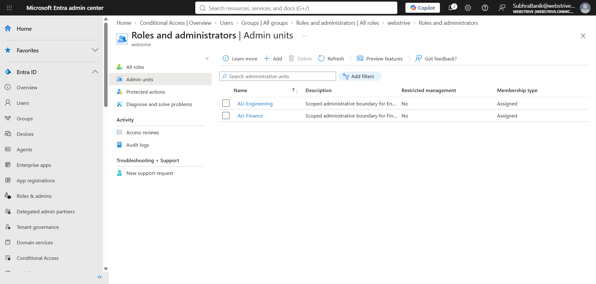

#### Dynamic Security Groups (ABAC)
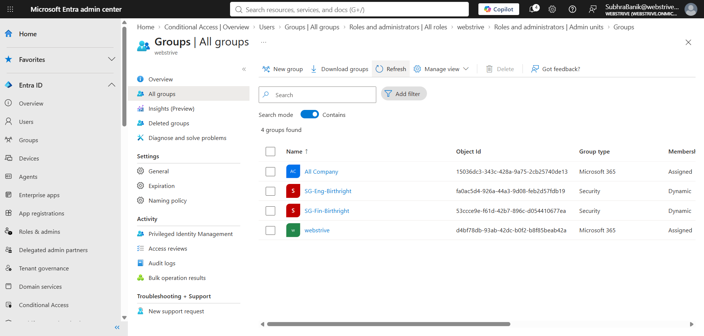

#### Group-Based Licensing
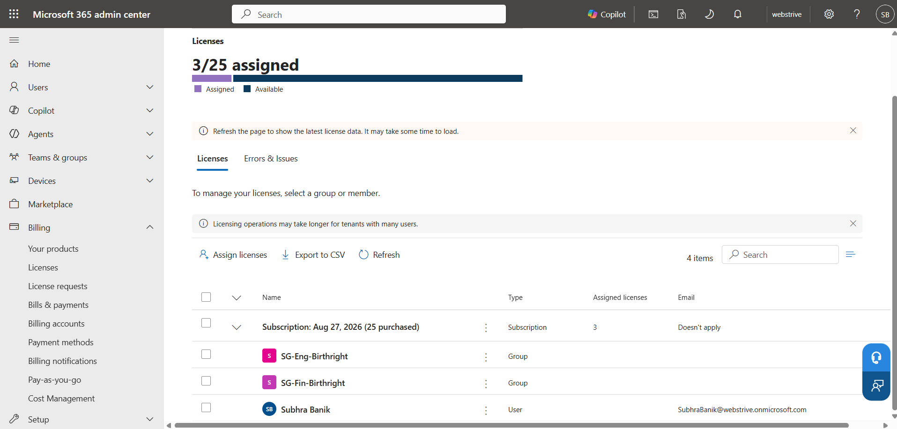

---

### 2. Joiner Phase (Provisioning)
#### Initial Provisioning Execution
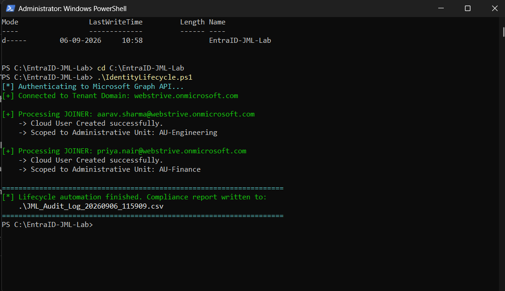

#### Batch Ingestion & Idempotent Skips
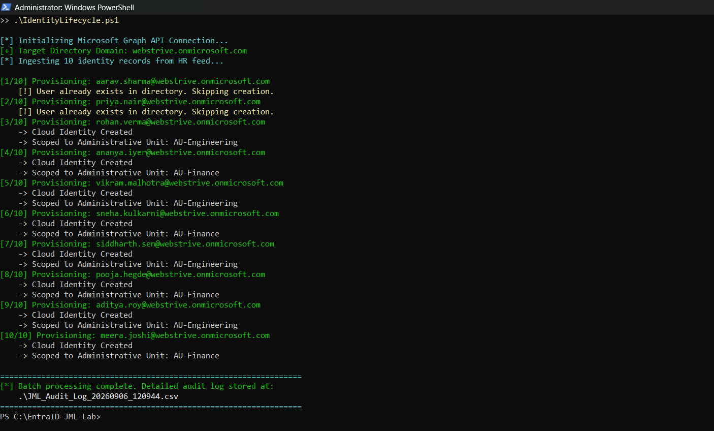

#### Provisioned Cloud Identities in Entra ID
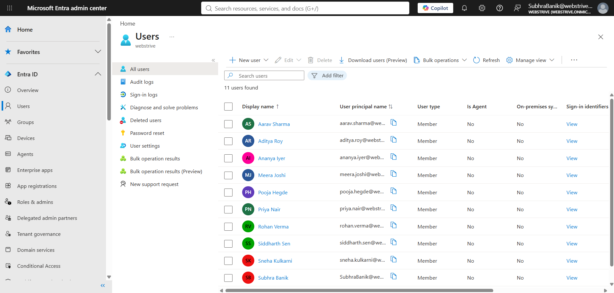

#### Administrative Unit Assignment
* **Engineering AU:**
  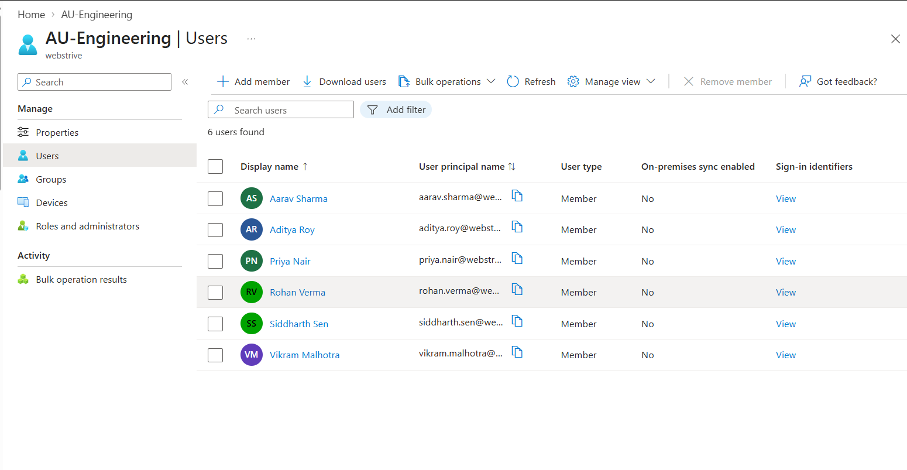
* **Finance AU:**
  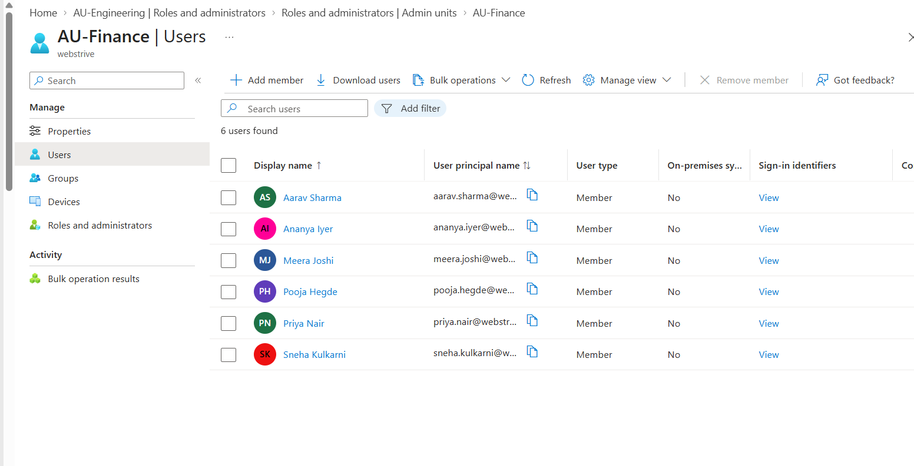

---

### 3. Mover Phase (Department Transition & Token Revocation)
#### Mover Script Execution
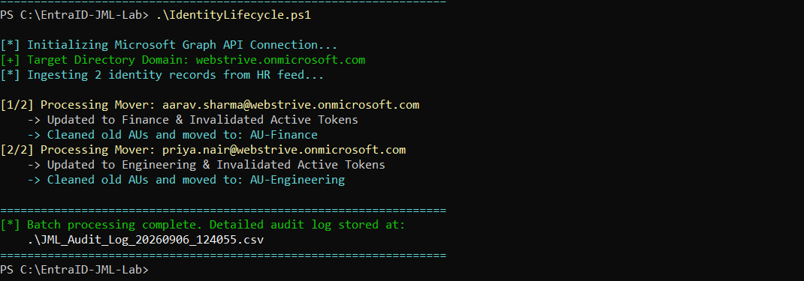

#### Post-Move Scoping Verification
* **Finance AU Updated:**
  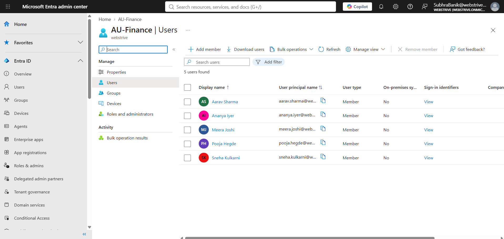
* **Engineering AU Updated:**
  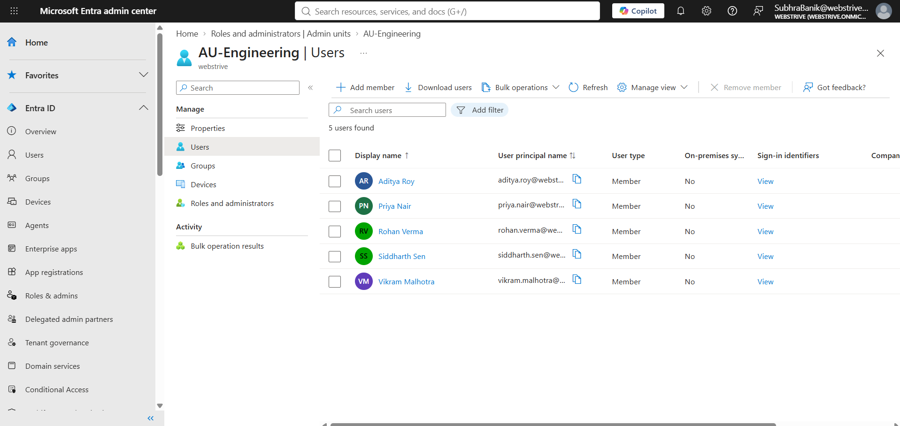

---

### 4. Leaver Phase (Zero Trust Deprovisioning)
#### Automated Deprovisioning Execution
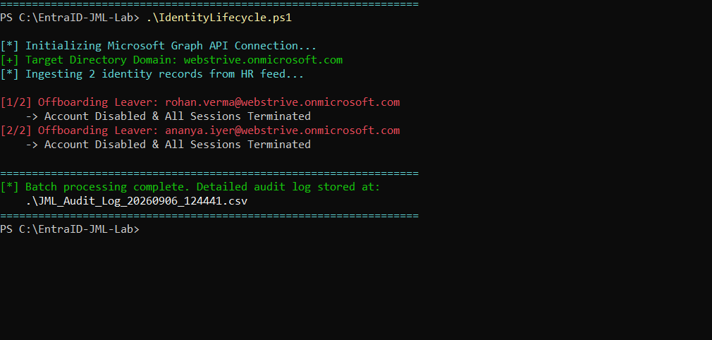

#### Disabled Account Status & Revocation Verification
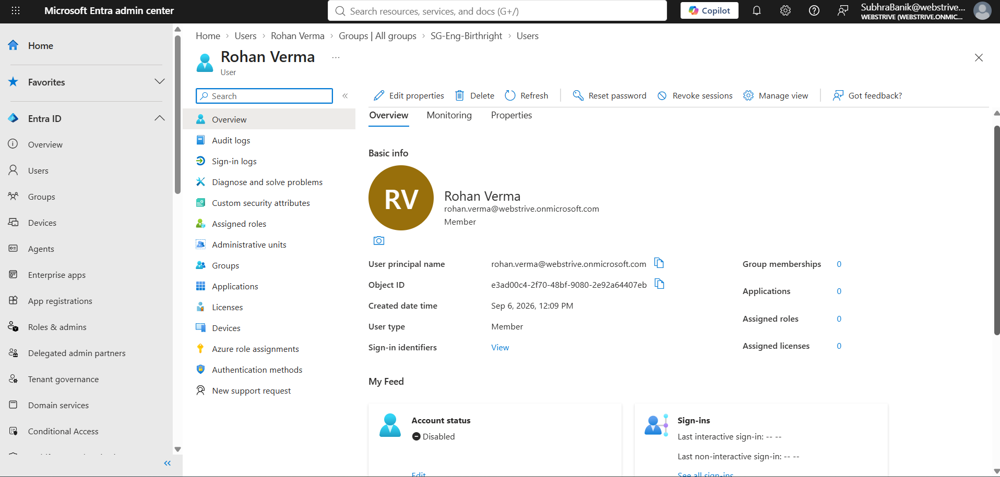

#### Administrative Unit Status Post-Offboarding
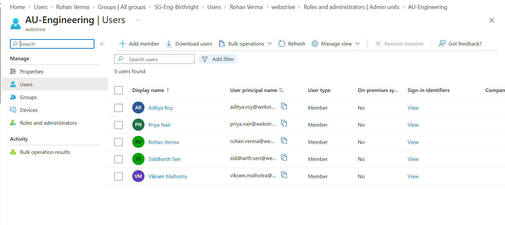

---

### 5. Compliance & Regulatory Audit Trail
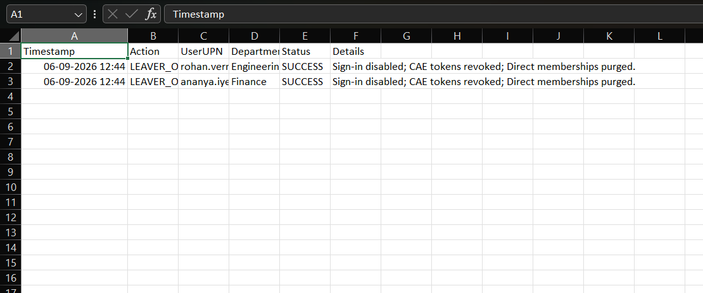

---

## 🚀 Repository Layout

text
C:\EntraID-JML-Lab

├── data/
│   └── HR_Feed.csv                   # Mock HR system input data
├── docs/
│   └── screenshots/                  # Verification evidence images
├── logs/
│   └── JML_Audit_Log_*.csv           # Timestamped compliance audit logs
├── scripts/
│   └── IdentityLifecycle.ps1         # Production PowerShell lifecycle engine
└── README.md

